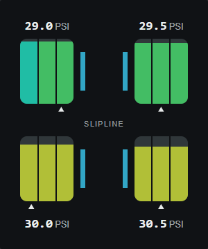

# Slipline

Clearer tyre audio and a compact racing dash for **BeamNG.drive 0.39.x**, with native tyre grip preserved.

**Version 0.2.4 removes the experimental grip modifier.** Tested with BeamNG.drive 0.39.4.0 (build 20972). Slipline does not replace the native tyre physics model. The 0.2.3 comparison found longer braking and sharper breakaway in one stress test, so the modifier was withdrawn.

*Preview uses sample telemetry; this is not an in-game screenshot.*

## Features

- Loads automatically, with no tuning part or activation required. Tyre grip remains under BeamNG or your thermal mod's control.
- Native tyre audio grows with measured slip, helping make sliding more audible.
- **Tyre Dash:** three tread-temperature bands per tyre and live pressure, with compact and larger layouts. Tap a tyre for details; switch between °C/°F and PSI/kPa.
- Optional integration with [Tyre Wear and Thermals Redux](https://www.beamng.com/resources/tyre-wear-and-thermals-redux.29934/). Redux supplies temperature, wear and grip; Slipline reads telemetry without applying another grip multiplier.

Wheel construction stays stock. Slipline does not increase polygon or physics-node counts.

## Resizing the dash

Drag the app resize handle in BeamNG's UI Apps editor. Suggested sizes: **small 160 × 180**, **medium 300 × 360**, **large 440 × 500**. Small or short apps use compact two-column readings; larger apps scale the car outline and tyre graphics. Width and height are independent, and temperature/pressure stay visible. Small detail views scroll vertically.

## Readings and behaviour

The main temperature is the average tread temperature. The detail view adds the three tread zones, core temperature, pressure, cold setpoint, remaining life, brake temperature and measured sideways slip. Pressure is live gauge pressure, not the configured cold pressure.

Temperature colours use Redux's **wear temperature target** as their reference; that target is not necessarily the temperature of maximum grip. Redux owns heat, wear, brake heat transfer and its wear-related punctures. Slipline does not run a second thermal or wear simulation.

Slipline's grip factor is **1.00**. It does not write friction coefficients, alter Redux's update order or change wheel construction. The optional base-grip reading uses Redux's latest available computed value and can lag its update by one frame. Tyre sound gain is capped at **1.8×** its existing coefficient and returns to baseline at rest, when unloaded or deflated. The shared native coefficient can also raise rolling and scrub sounds; intentionally muted tyres remain muted.

## Compatibility and troubleshooting

- Known Redux bridge tested with **Redux 0.20**. It reads an internal computed-grip table, so future Redux changes may remove that reading. Redux continues to control tyre physics if the interface cannot be read.
- Other mods that write tyre audio coefficients can conflict. GGT and other grip mods can still change handling independently of Slipline; disable them when comparing with stock.
- Multiplayer, every vehicle/mod combination and long high-speed sessions have not been validated.
- If readings are missing, check that Redux is enabled for temperature/life, then restart the game and respawn. Stale data dims and displays `NO DATA`.
- If updating from the withdrawn density prototype, a **full game restart** is necessary; existing cars can retain previously generated wheels.
- When updating from 0.2.3 or earlier, fully restart the game to discard the old runtime grip modifier.
- For bug reports, include game/mod versions, vehicle/configuration, tyre compound/size, reproduction steps and relevant lines from `beamng.log` in the current user folder. Review logs for personal information before sharing.
