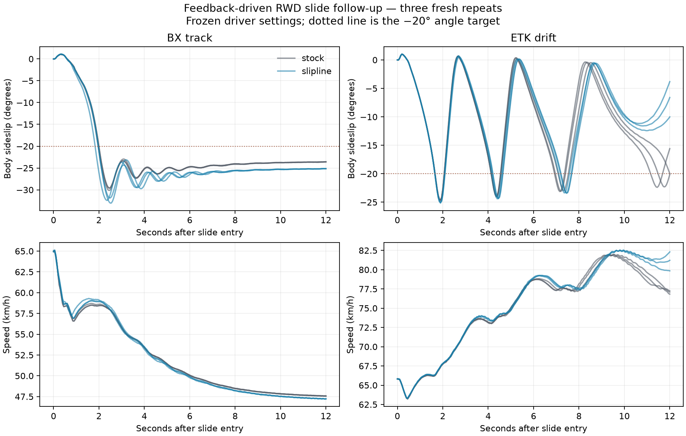

# Feedback-driven drift follow-up

Twelve additional visible runs: BX track and ETK I-Series drift, stock versus Slipline 0.2.3, three fresh repeats each. Redux was not included in this follow-up. Mod coefficients remained unchanged.

The original aggressive input spins these cars. A separate stock-only pilot qualified a feedback driver; its settings were frozen before these fresh stock and Slipline runs. The driver targets −20° body sideslip and uses the same steering feedback and rear-rim-speed throttle rule for both cars and both conditions. Feedforward = 0.12; rim ratio = 1.25; other gains are in `slipline_drift_driver.lua`. Closed-loop inputs can differ in response to the changed car state. This compares the resulting state and required control, not identical pedal histories.

After the two-second slide-entry period, qualification requires a continuous 2 s with speed above 10 m/s and body sideslip between 10° and 40°, less than 0.25 s above 60°, and mean rear-rim overdrive above 1.10. It is a limited sustained-slide criterion, not proof of skilled human drifting or realistic forces.

| Car | Slide time s: stock → Slipline | Longest continuous slide s | Angle error RMS ° | Qualified / 6 |
| --- | --- | --- | --- | --- |
| BX_track | 10.05 → 10.05 | 10.05 → 10.05 | 4.88 → 6.44 | 6 |
| ETK_drift | 5.55 → 4.87 | 2.42 → 1.85 | 11.48 → 12.16 | 4 |

10 of 12 runs qualify; 0 failed tyre observations. Mean speed differs between conditions and must be considered alongside the angle/control measurements. Longer sliding duration alone is not an improvement score. These runs provide a repeatable sustained-slide comparison, while human feel, sound and real-world tyre-force accuracy remain unvalidated.

BX qualifies in all six runs, but its mean angle-tracking RMS error increases from 4.88° to 6.44° with Slipline and it requires more steering correction. ETK stock qualifies in all three repeats; Slipline qualifies in one of three. The two failed Slipline repeats remain in every aggregate and plot. Neither car spins under this driver. This follow-up provides no drift-control benefit for the current modifier under the tested control rule.

Per-run measurements: `controlled_drift_metrics.csv`; paired means: `controlled_drift_summary.json`. All raw samples and the frozen driver are included in the validation bundle. Pilot runs are excluded from the scored results.
