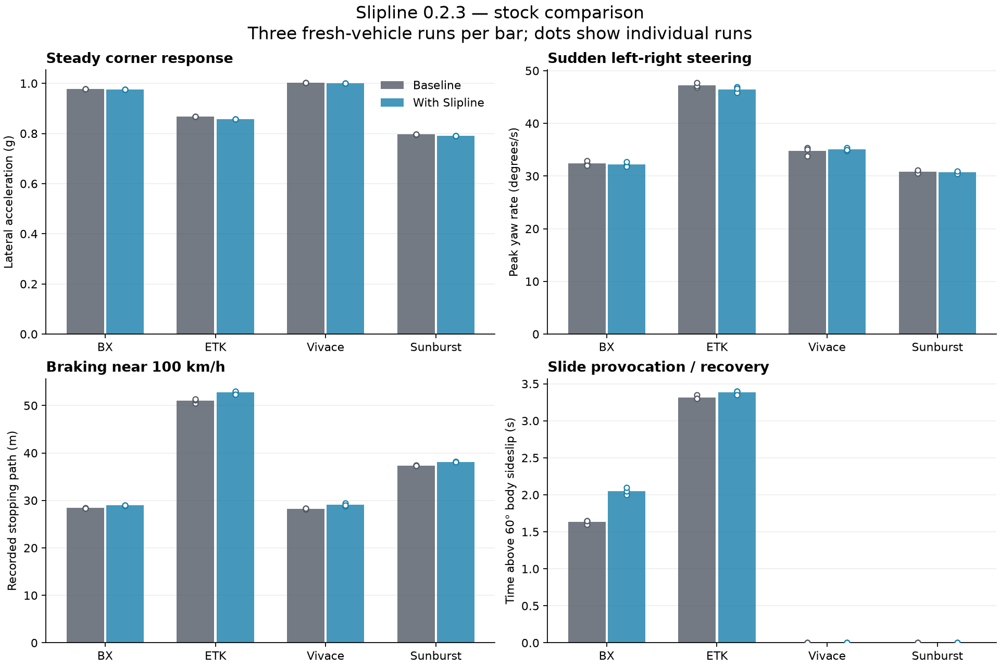
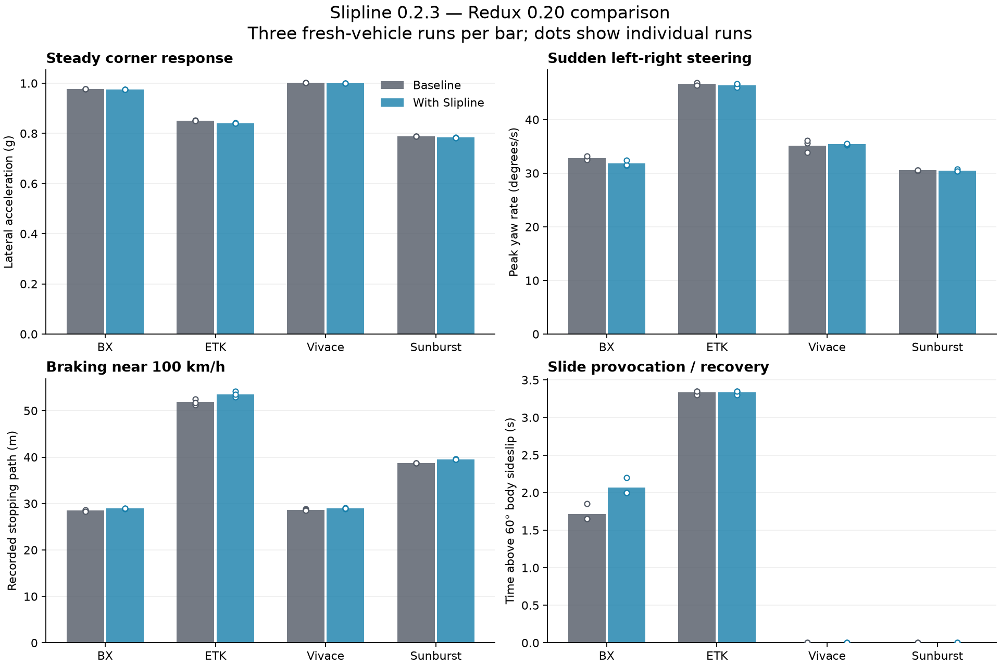

# Slipline 0.2.3 grip-response validation

BeamNG.drive 0.39.4.0 build 20972 · 2026-10-03 · Smallgrid

**The current grip modifier has a measurable braking cost.** Across these eight vehicle/condition comparisons, the recorded stopping path increased by 1.25–3.44%. This study does not establish a handling or realism benefit. Keep the experimental label; revisit the constant 0.98 baseline and sustained-slip reduction before claiming improved grip response.

## Scope and method

192 recorded runs: four factory configurations × four manoeuvres × four conditions × three repeats. Conditions were stock, Slipline alone, Tyre Wear and Thermals Redux 0.20 alone, and Redux plus Slipline. Each condition ran in a separate visible Direct3D11 game process with a separate test user folder. Every run restarted the scenario to reset tyres and vehicle state. The normal user profile was not used.

Configurations: BX `vehicles/bx/track_M.pc` (RWD, race tyres), ETK I-Series `vehicles/etki/drift.pc` (RWD, drift tyres), Vivace `vehicles/vivace/trackday_M.pc` (FWD), and Sunburst `vehicles/sunburst2/sport_RS_M.pc` (AWD). Cars were separated by 600 m. Arcade transmission; ESC drive mode off where supported; factory ABS retained. Both conditions received the same scripted driver rules. Cornering/warmup use the same speed-feedback rule, so actual throttle can differ slightly. Redux used its fresh-profile defaults, including its compound-dependent initial temperature: race tyres begin warm. These profiles do not reproduce a user's customized Redux settings. Initial mean tread-temperature ranges are retained in `audit.json`.

Simulation used 20 fixed update frames per second; all recorded vehicle updates were 0.050000001–0.050000001 s. Fixed timing improves repeatability but is not a guarantee of complete determinism. [BeamNG deterministic-mode documentation](https://documentation.beamng.com/beamng_tech/deterministic_mode/)

- **Cornering:** entry target 72 km/h; steering ramps to 0.12, then 0.22. Moderate-response window 14–17 s; tighter-response window 22–28 s. Reported g is acceleration under this prescribed input, not maximum available grip. Speed and yaw stability are checked.
- **Sudden steering:** +0.18 for one second, −0.18 for one second, then neutral at approximately 72 km/h. Report peak yaw rate and recovery separately. A larger peak is not automatically better.
- **Braking:** full brake from approximately 100 km/h; stopping path follows sampled XY positions until speed is below 0.5 m/s. A secondary distance estimate scales by entry speed squared; it is a sensitivity check, not a separate physical run.
- **Slide provocation:** entry target 64.8 km/h, a brief handbrake/steering input, then fixed power and countersteer. Count sideslip between 10° and 60° only above 5 m/s; time above 60° is reported separately. Controlled-drift criterion: at least 2 s in the slide band and less than 0.25 s above 60°. This manoeuvre is a repeatable provocation, not a skilled drift driver.

Early harness pilots are excluded. All reported runs used visible graphics. Three repeats describe this setup's variation; they do not establish statistical confidence across tracks, drivers or game versions.

Three additional studies bring the total to **516 scored visible runs across seven car families**: [168 matched-size compound runs](compound_matrix/Compound-validation.md) add Covet, ETK 800 and SBR4 with standard, sport, race and drift tyres; [12 feedback-driven RWD runs](Controlled-drift-followup.md) examine sustained sliding; [144 slip-angle, trail-braking and lift/reversal runs](handling/Handling-response-validation.md), completed across October 3–4, examine handling transitions at 20 ms updates. Their limitations and failed qualifications are retained separately. The additional compound braking penalties range from 1.45% to 5.37%.

The handling follow-up finds a repeatable harsher Vivace breakaway in the combined lift/reversal stress case: mean moving event sideslip **51.10° → 62.82°**, maximum 100 ms sideslip growth **35.49°/s → 48.78°/s**, and the 10°→30° transition interval **0.97 s → 0.83 s**. Other cars and trail-braking inputs show smaller, mixed changes. This supports redesigning the current grip refinement for the stated predictability goal; it is not a real-world tyre validation.

## Braking

| Baseline | Car | Baseline m | With Slipline m | Change | Paired range m | 100 km/h normalized Δm |
| --- | --- | --- | --- | --- | --- | --- |
| stock | BX track (RWD) | 28.42 | 28.98 | +0.56 m (+1.98%) | +0.43…+0.67 | +0.55 |
| stock | ETK drift (RWD) | 51.02 | 52.77 | +1.75 m (+3.44%) | +1.00…+2.40 | +1.78 |
| stock | Vivace track (FWD) | 28.27 | 29.08 | +0.81 m (+2.86%) | +0.64…+1.09 | +0.80 |
| stock | Sunburst RS (AWD) | 37.36 | 38.11 | +0.75 m (+2.02%) | +0.72…+0.79 | +0.75 |
| redux | BX track (RWD) | 28.48 | 28.97 | +0.49 m (+1.72%) | +0.26…+0.69 | +0.49 |
| redux | ETK drift (RWD) | 51.81 | 53.55 | +1.74 m (+3.36%) | +1.72…+1.76 | +1.71 |
| redux | Vivace track (FWD) | 28.62 | 28.98 | +0.36 m (+1.25%) | +0.28…+0.46 | +0.38 |
| redux | Sunburst RS (AWD) | 38.72 | 39.53 | +0.80 m (+2.08%) | +0.74…+0.88 | +0.80 |

Positive distance changes mean a longer stop. The paired range is the minimum and maximum of three repeat-wise differences, not a confidence interval. Controls and telemetry update every 50 ms, so stop times are quantized and transient peaks can be missed. Sampled path lengths are comparison estimates; higher-rate follow-up would improve precision.

## Cornering and sudden steering

| Baseline | Car | Tighter corner g | Change | Peak yaw °/s | Change |
| --- | --- | --- | --- | --- | --- |
| stock | BX track (RWD) | 0.978 → 0.975 | -0.31% | 32.42 → 32.19 | -0.69% |
| stock | ETK drift (RWD) | 0.867 → 0.857 | -1.10% | 47.22 → 46.45 | -1.63% |
| stock | Vivace track (FWD) | 1.003 → 1.000 | -0.30% | 34.73 → 35.07 | +0.95% |
| stock | Sunburst RS (AWD) | 0.796 → 0.792 | -0.57% | 30.82 → 30.72 | -0.34% |
| redux | BX track (RWD) | 0.977 → 0.974 | -0.31% | 32.82 → 31.81 | -3.09% |
| redux | ETK drift (RWD) | 0.851 → 0.841 | -1.21% | 46.65 → 46.42 | -0.50% |
| redux | Vivace track (FWD) | 1.003 → 1.000 | -0.30% | 35.18 → 35.40 | +0.62% |
| redux | Sunburst RS (AWD) | 0.788 → 0.783 | -0.63% | 30.55 → 30.50 | -0.15% |

Detailed moderate/tighter corner response, radius, sideslip, entry speeds, rise time and recovery values are in `run_metrics.csv` and `summary.json`. These prescribed inputs do not measure the full friction ellipse, force versus slip-angle curve, aligning torque or steering-wheel feel.

## Drifting limitation

| Condition | Car | 10–60° slide s (mean) | Above 60° s (mean) | Controlled runs / 3 |
| --- | --- | --- | --- | --- |
| stock | BX track (RWD) | 1.12 | 1.63 | 0 |
| stock | ETK drift (RWD) | 2.32 | 3.32 | 0 |
| stock | Vivace track (FWD) | 0.68 | 0.00 | 0 |
| stock | Sunburst RS (AWD) | 0.00 | 0.00 | 0 |
| slipline | BX track (RWD) | 1.12 | 2.05 | 0 |
| slipline | ETK drift (RWD) | 2.27 | 3.38 | 0 |
| slipline | Vivace track (FWD) | 0.87 | 0.00 | 0 |
| slipline | Sunburst RS (AWD) | 0.00 | 0.00 | 0 |
| redux | BX track (RWD) | 1.12 | 1.72 | 0 |
| redux | ETK drift (RWD) | 2.32 | 3.33 | 0 |
| redux | Vivace track (FWD) | 0.68 | 0.00 | 0 |
| redux | Sunburst RS (AWD) | 0.00 | 0.00 | 0 |
| redux_slipline | BX track (RWD) | 1.13 | 2.07 | 0 |
| redux_slipline | ETK drift (RWD) | 2.30 | 3.33 | 0 |
| redux_slipline | Vivace track (FWD) | 0.85 | 0.00 | 0 |
| redux_slipline | Sunburst RS (AWD) | 0.00 | 0.00 | 0 |

The rear-wheel-drive cars spin under this aggressive input; Vivace shows a brief slide; Sunburst does not enter a meaningful slide. Do not interpret longer slide duration or a change in spin time as improved drift control. This manoeuvre alone does not validate controlled drifting. A separate, frozen feedback-driver comparison adds twelve RWD runs and retains its failed qualifications; see [the drift follow-up](Controlled-drift-followup.md).

## Safety and Redux composition

- 0 flat, punctured or broken tyre observations across 309,336 wheel samples. Lowest sampled gauge pressure: 23.17 PSI. This is short-run coverage, not a long thermal/endurance test.
- Factory active-part configurations match across conditions: True. Recorded wheel ray counts: [16]. No wheel-density modification was used.
- Grip factors observed: 0.920235–1.000000; bounds violations: 0; non-finite vehicle samples: 0.
- ESC-active samples: 0; TC-active samples: 0.
- Redux bridge active on all combined runs: True; bridge failure flag: False. 69,896 composed wheel samples checked; maximum `combined − base × factor` error: 1.43e-14. Maximum same-sample Redux-base discrepancy: 0.
- Largest paired entry-speed difference: 0.297 km/h. Largest paired mean tread-temperature difference on Redux runs: 0.045 °C. Raw per-wheel temperatures are retained; mean temperature can conceal a single hot tyre.

Compatibility here means the known Redux bridge composes the measured factors and preserves intact tyres during these short runs. It does not settle multi-lap heating, brake heat transfer, wear-related punctures or other tyre mods.

The aggressive ETK slide/spin reaches a hottest tread-zone reading of 431.5°C with Redux alone and 441.8°C with Redux plus Slipline. These are Redux-model readings under severe wheelspin, not real-world temperature validation. They should not be used as normal drifting temperature targets. Per-car peaks and core readings are retained in the data.

## Files and provenance

[Download the validation bundle](https://github.com/kxrxh/Slipline/releases/download/v0.2.3/Slipline-0.2.3-grip-validation.zip) for all scored raw telemetry, reports and plots. [Original repeatable test source](https://github.com/kxrxh/Slipline/tree/main/validation/grip_response) is separate from the installable mod ZIP.

`stock_comparison.png` / `redux_comparison.png`: means and individual-run dots. `stock_traces.png` / `redux_traces.png`: all three traces. `run_metrics.csv`: each run's measurements and qualification flags. `summary.json`: paired means, standard deviations and ranges. `audit.json`: composition and integrity checks. `raw_telemetry.zip`: complete sampled telemetry and original test scripts.

Tested release ZIP SHA-256: `897213f666d6071cc56a1d8a7aaead77de8469cbf4af0c760d6cd976172262fb`. Recorder SHA-256 at analysis: `c8b726a576a612947a24883dd023ce08a3cd9c57871c622f8da64ee0e8d81b4d`. No released grip coefficients changed during this study. Read-only Redux temperature/wear telemetry was added after the stock process started; driver commands and timing were unchanged. The recording helper only commands driver inputs and reads vehicle state; it does not set tyre friction, tyre pressure or Redux thermal state.

## Next development step

Use a neutral native-grip control and isolate the constant reduction, sustained-slip penalty and recovery penalty in separate ablations before designing the next transient response. Repeat braking, the Vivace breakaway and controlled drifting on a fresh held-out set; improve the drift driver's speed regulation. Higher-rate braking measurements would improve distance/peak precision. Do not tune and score against the same runs without a separate validation set. Leave the current release marked experimental until an independently held-out comparison supports the intended benefit.
