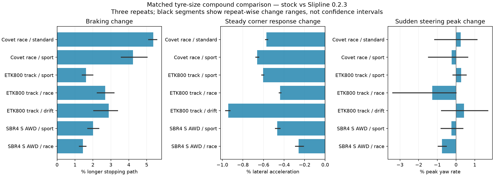

# Additional cars and compounds

168 visible runs: seven native tyre configurations × four manoeuvres × two conditions × three repeats. Stock is compared against Slipline 0.2.3; Redux is excluded from this additional matrix. All runs use the same driving rules, fixed 50 ms updates and per-run scenario resets as the first study.

Covet race (FWD) uses 195/60R15 standard and sport tyres. ETK 800 844 track (RWD) uses 245/35R17 sport, race and drift tyres. SBR4 S AWD uses 225/40R18 front and 295/30R18 rear sport and race tyres. Within each family, wheel parts, nominal tyre sizes, suspension, drivetrain and all other configuration choices match; front/rear cold setpoints are explicitly 28 PSI. These are controlled test setups based on factory configurations, not unchanged factory presets. Live gauge pressure still varies with load and tyre state.

Factory parts do not offer all compounds in every size. No tyre geometry was cloned or altered to manufacture missing compounds. Factory configuration names and selected tyres are retained in the data; runtime-generated configuration files are not redistributed.

The game window closed during the final Slipline batch. The preceding 161 completed runs were retained, and only the seven unrecorded final runs were repeated in a fresh visible process with the same reset/setup protocol. No partial interrupted trajectory is scored. The raw dataset records this resumption.

| Car / compound | Tyres F / R | Stop m: stock → Slipline | Change | Corner change | Peak yaw change |
| --- | --- | --- | --- | --- | --- |
| Covet_race / standard | 195/60R15 / 195/60R15 | 50.30 → 53.00 | +5.37% | -0.57% | +0.25% |
| Covet_race / sport | 195/60R15 / 195/60R15 | 46.27 → 48.23 | +4.24% | -0.66% | -0.23% |
| ETK800_track / sport | 245/35R17 / 245/35R17 | 38.39 → 39.00 | +1.61% | -0.60% | +0.28% |
| ETK800_track / race | 245/35R17 / 245/35R17 | 29.83 → 30.63 | +2.68% | -0.44% | -1.27% |
| ETK800_track / drift | 245/35R17 / 245/35R17 | 46.83 → 48.17 | +2.88% | -0.94% | +0.42% |
| SBR4_S_AWD / sport | 225/40R18 / 295/30R18 | 36.25 → 36.98 | +2.01% | -0.47% | -0.25% |
| SBR4_S_AWD / race | 225/40R18 / 295/30R18 | 29.47 → 29.90 | +1.45% | -0.26% | -0.75% |

Mean stopping paths change by +1.45–+5.37% across the seven matched-size cases. The repeat-wise distance range and entry-speed-normalized estimate are retained in `summary.json`; small differences should be read against that variation and the 50 ms sampling. No real tyre reference data was used, so a longer stop is a measured performance cost, not proof that either condition is more physically accurate.

| Setup | Qualified corner / 6 | Steering / 6 | Braking / 6 | Slide provocation / 6 |
| --- | --- | --- | --- | --- |
| Covet_race_standard | 6 | 6 | 6 | 3 |
| Covet_race_sport | 6 | 6 | 6 | 0 |
| ETK800_track_sport | 6 | 6 | 6 | 6 |
| ETK800_track_race | 6 | 6 | 6 | 0 |
| ETK800_track_drift | 6 | 6 | 6 | 6 |
| SBR4_S_AWD_sport | 6 | 6 | 6 | 6 |
| SBR4_S_AWD_race | 6 | 6 | 6 | 0 |

Tyre failure observations: 0. Stock/Slipline active-part configurations match: True; selected tyre parts were verified on every recorded run: True. Ray counts: [16]; multiplier-bound violations: 0. Largest paired entry-speed difference: 0.553 km/h.

Black plot segments are the three repeat-wise difference ranges, not confidence intervals. Corner acceleration is the response to the prescribed steering, not peak available grip. Changes in peak yaw do not constitute a handling quality score. The fourth manoeuvre is the original aggressive slide provocation; it is retained in the CSV with qualification flags and must not be interpreted as sustained controlled drifting. The separate RWD feedback-driver follow-up addresses that limitation.

Per-run data and qualifications: `run_metrics.csv`. Paired means, standard deviations and secondary measurements: `summary.json`. Integrity checks: `audit.json`. All raw data belongs to this bounded dry, flat Smallgrid test; it does not cover every car, surface, speed, mod or human driver.
