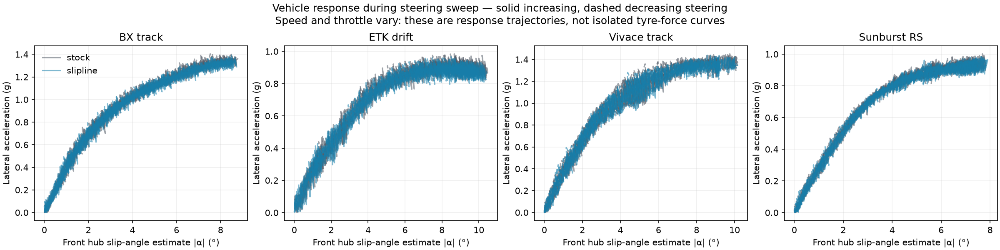
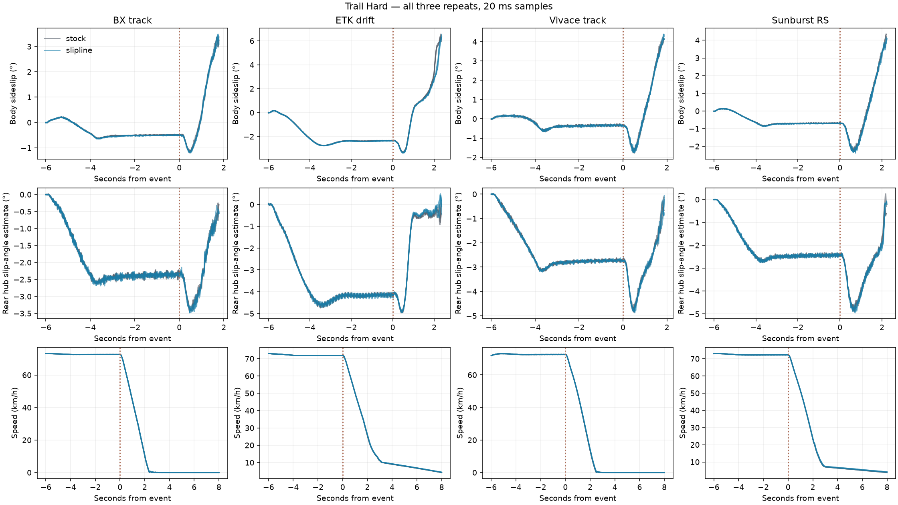
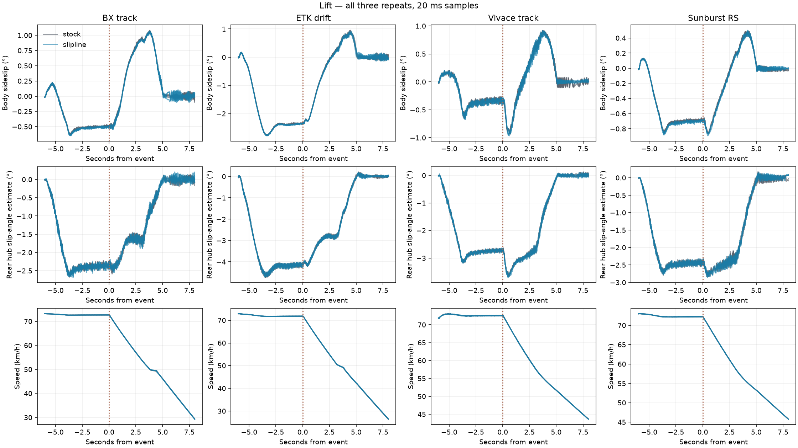
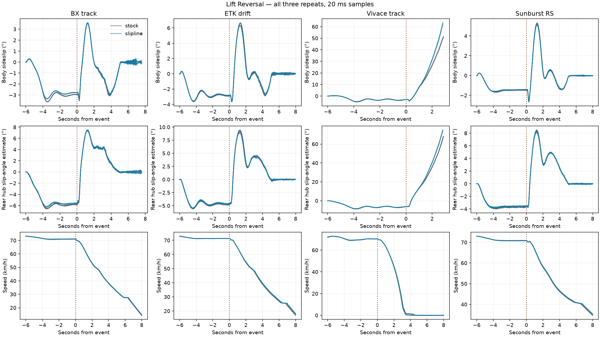

# Slip angle, trail braking and lift-off response

Recorded interval (Europe/Moscow): 2026-10-03T23:45:25+03:00 → 2026-10-04T00:04:11+03:00

144 visible stock/Slipline 0.2.3 runs: BX track and ETK I-Series drift (RWD), Vivace track (FWD), Sunburst RS (AWD), six manoeuvres, three repeats and two conditions. Redux is excluded. Released coefficients remain unchanged. Fixed update interval is 20 ms (50 Hz); tyre physics still runs at the game's native internal rate. Each run resets vehicle state; ESC is off where supported and factory ABS remains enabled. Arcade transmission can downshift under deceleration.

A stock-only pilot checked these inputs before the scored comparison. Steering sweep: at a 72 km/h entry target, increase normalized steering from zero to 0.45 over eight seconds, hold two seconds, then decrease over eight seconds. Speed feedback uses the same rule in both conditions, so actual throttle and achieved speed can differ. A sweep that saturates or spins is retained; the plot is a vehicle response trajectory, not a calibrated tyre force/slip-angle curve.

For the other inputs, ramp steering to 0.22 over two seconds, settle four seconds, then apply the event at t=18 s. Hold is a speed-feedback throttle control. Lift removes throttle for three seconds. Mild/heavy trail braking removes throttle and ramps the brake pedal to 0.25/0.50 in 0.25 s, holds until t=20 s, then releases over one second. At t=21 s all four inputs remove throttle and unwind steering over two seconds, with recovery observed through t=26 s. Brake pedal fractions are not fixed deceleration targets.

The additional lift/reversal stress case first settles at +0.50 steering, then removes throttle and reverses steering to −0.50 over 0.30 s. It holds that input until t=21 s, then unwinds to zero over two seconds. A stock-only pilot at ±0.35 gave limited sideslip, so ±0.50 was selected before scoring either condition. This deliberately tests a stronger weight-transfer/steering transition; it is separate from a pure throttle-lift test. All inputs are prescribed driver actions, with no edits to tyre or chassis state.

To obtain 20 ms updates, deterministic mode uses speed factor −1 with a 50 FPS limit. A timing pilot using positive speed factor 1 retained 50 ms controller updates and is excluded. The scored runs assert their actual minimum and maximum time steps. [BeamNG timing documentation](https://documentation.beamng.com/beamng_tech/deterministic_mode/)

Per-wheel alpha is a **kinematic hub estimate**: project average wheel-axis-node velocity onto the rolling/lateral directions derived from the wheel axis and vehicle up vector. It includes steered-wheel geometry; body sideslip is recorded separately. It is not a direct contact-patch force or aligning-torque measurement. Rear/front alpha difference is a response indicator, not a standalone understeer classification.

Sideslip rate and yaw acceleration use a 100 ms finite difference to limit single-frame noise. Angle differences are wrapped across ±180°. Primary settled-turn event metrics use t=18–21 s; subsequent steering unwind and recovery are reported separately. Post-event spin duration covers the complete remainder of the run. Event metrics exclude speed below 5 m/s. Entries qualify if within 3 km/h of 72 and, for settled-turn events, body sideslip below 10°. All failed entries and all repeats remain in the metrics, plots and aggregates. Three repeats describe this setup's variation; differences are not statistical confidence or a human feel score.

In the Vivace lift/reversal case, mean moving event sideslip rises from 51.10° to 62.82°, and its maximum 100 ms growth rate rises from 35.49°/s to 48.78°/s. The mean 10°→30° transition interval falls from 0.97 s to 0.83 s. Largest paired entry-speed difference in this case: 0.129 km/h. This is a repeatable harsher breakaway under this prescribed stress input. It does not establish a universal spin threshold or real-world tyre accuracy. Other cars and inputs show smaller, mixed changes; they are retained below.

| Car / input | Peak sideslip ° stock → Slipline | Max 100 ms sideslip rate °/s | Recovery RMS ° | Entries qualify / 6 |
| --- | --- | --- | --- | --- |
| BX_track / sweep | 2.92 → 2.73 | 1.51 → 1.29 | 0.44 → 0.45 | 6 |
| BX_track / hold | 0.50 → 0.52 | 0.40 → 0.40 | 0.01 → 0.01 | 6 |
| BX_track / trail_mild | 3.43 → 3.43 | 3.52 → 4.07 | — (insufficient moving samples) | 6 |
| BX_track / trail_hard | 3.32 → 3.45 | 6.92 → 6.82 | — (insufficient moving samples) | 6 |
| BX_track / lift | 0.94 → 0.93 | 1.24 → 1.32 | 0.04 → 0.05 | 6 |
| BX_track / lift_reversal | 3.55 → 3.57 | 13.39 → 12.96 | 0.11 → 0.13 | 6 |
| ETK_drift / sweep | 3.10 → 3.01 | 1.14 → 1.13 | 1.65 → 1.63 | 6 |
| ETK_drift / hold | 2.36 → 2.38 | 0.37 → 0.39 | 0.04 → 0.02 | 6 |
| ETK_drift / trail_mild | 4.97 → 4.95 | 5.29 → 5.50 | — (insufficient moving samples) | 6 |
| ETK_drift / trail_hard | 6.43 → 6.39 | 19.36 → 17.61 | — (insufficient moving samples) | 6 |
| ETK_drift / lift | 2.35 → 2.37 | 1.68 → 1.64 | 0.06 → 0.07 | 6 |
| ETK_drift / lift_reversal | 6.66 → 6.33 | 20.47 → 20.01 | 0.08 → 0.08 | 6 |
| Sunburst_RS / sweep | 1.46 → 1.42 | 0.59 → 0.63 | 0.49 → 0.50 | 6 |
| Sunburst_RS / hold | 0.71 → 0.73 | 0.39 → 0.41 | 0.01 → 0.01 | 6 |
| Sunburst_RS / trail_mild | 3.59 → 3.57 | 5.30 → 5.49 | 0.07 → 0.08 | 6 |
| Sunburst_RS / trail_hard | 4.30 → 4.08 | 7.78 → 8.15 | — (insufficient moving samples) | 6 |
| Sunburst_RS / lift | 0.86 → 0.88 | 1.00 → 1.00 | 0.02 → 0.01 | 6 |
| Sunburst_RS / lift_reversal | 5.30 → 5.14 | 11.88 → 11.85 | 0.02 → 0.03 | 6 |
| Vivace_track / sweep | 3.96 → 3.82 | 2.33 → 2.36 | 1.06 → 1.06 | 6 |
| Vivace_track / hold | 0.39 → 0.40 | 0.92 → 0.88 | 0.03 → 0.04 | 6 |
| Vivace_track / trail_mild | 4.20 → 4.18 | 5.60 → 5.37 | — (insufficient moving samples) | 6 |
| Vivace_track / trail_hard | 4.18 → 4.32 | 8.15 → 7.74 | — (insufficient moving samples) | 6 |
| Vivace_track / lift | 0.93 → 0.96 | 2.36 → 2.41 | 0.05 → 0.02 | 6 |
| Vivace_track / lift_reversal | 51.10 → 62.82 | 35.49 → 48.78 | — (insufficient moving samples) | 6 |

Failed tyre observations: 0. Geometric wheel-angle telemetry available throughout: True. Runs with body sideslip above 60° while moving faster than 5 m/s: 3.

Raw metrics also retain first crossing of 10° and 30° body sideslip and the interval between them, as descriptive transition thresholds. Missing crossings remain missing; they are not averaged as zero. The paired summary retains crossing and spin counts for each condition. Plots mask angles below 5 m/s and break lines at the ±180° wrap to avoid drawing a mathematical discontinuity as a physical snap. Missing recovery measurements mean insufficient moving samples, not zero recovery error.

All steering-sweep time traces: `sweep_traces.png`. Per-run input/response metrics: `run_metrics.csv`; paired means, standard deviations and repeat-wise delta ranges: `summary.json`. Interpreting a smaller sideslip rate as smoother requires checking achieved speed, initial state, recovery and whether a car spins. These tests can expose abruptness and loss of control, but cannot establish real-world tyre fidelity without external reference measurements.
