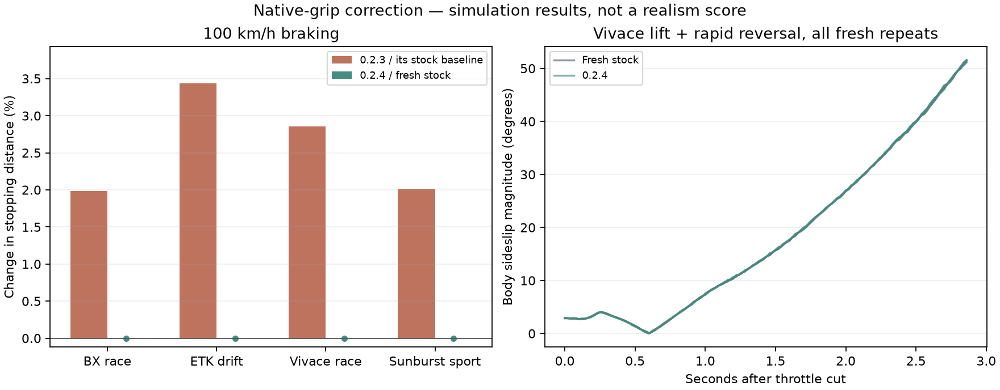

# Native-grip correction — Slipline 0.2.4

The 0.2.3 study found longer braking, no consistent trail-braking benefit, and sharper Vivace breakaway. Version 0.2.4 withdraws that modifier entirely. There is no new force model: BeamNG or the installed thermal mod owns grip. Slipline only reads grip telemetry and retains tyre audio and the responsive dash.

## Fresh visible checks

84 scored runs on BeamNG.drive 0.39.4.0, smallgrid, three repeats per case. All game sessions used a visible Direct3D11 window and isolated profiles. No headless runs. Factory ABS retained; ESC off where supported. The original driving inputs were frozen before this revision.

The handling and controlled-slide profiles reused only the graphics shader cache from the completed stock braking profile to avoid repeated shader compilation. Mods, vehicle state and settings were not cloned.

- Braking: BX race, ETK I-Series drift, Vivace race and Sunburst sport; stock, 0.2.4, Redux 0.20 and Redux + 0.2.4 (48 runs, 50 ms recorded steps).
- Hard trail braking and throttle lift with rapid steering reversal: BX and Vivace; fresh stock versus 0.2.4 (24 runs, 20 ms recorded steps).
- Feedback-controlled RWD slide: BX race and ETK I-Series drift; fresh stock versus 0.2.4 (12 runs, 50 ms recorded steps).

The old-release figures below are historical results from the published 0.2.3 study, each compared with its own stock baseline. The current revision is compared with fresh stock runs. No old-release runs were rerun here, and historical figures are not paired repeat-by-repeat with the revision.

Tables show the mean of three run measurements per condition. Peak measurements are the mean of the per-run peaks, rather than the largest value across the whole study. All repeats remain in the CSVs.

## Braking

| Baseline | Car / tyre | Baseline m | 0.2.4 m | Change | Historical 0.2.3 change |
| --- | --- | ---: | ---: | ---: | ---: |
| stock | BX_track | 28.53 | 28.53 | +0.00% | +1.98% |
| stock | ETK_drift | 50.91 | 50.91 | +0.00% | +3.44% |
| stock | Vivace_track | 28.38 | 28.38 | +0.00% | +2.86% |
| stock | Sunburst_RS | 37.36 | 37.36 | +0.00% | +2.02% |
| redux | BX_track | 28.43 | 28.43 | +0.00% | +1.72% |
| redux | ETK_drift | 51.91 | 51.91 | +0.00% | +3.36% |
| redux | Vivace_track | 28.53 | 28.53 | +0.00% | +1.25% |
| redux | Sunburst_RS | 38.62 | 38.62 | +0.00% | +2.08% |

These are path distances from the first full-brake sample until speed falls below 0.5 m/s. Entry speeds and every repeat are in `braking_metrics.csv`. Small differences can reflect entry speed and simulation repeat variation. Longer braking is not used as a realism benefit.

## Handling transitions

| Car | Input | Fresh stock peak body sideslip | 0.2.4 peak | Fresh stock / 0.2.4 peak growth rate |
| --- | --- | ---: | ---: | ---: |
| BX_track | trail_hard | 3.38° | 3.38° | 6.64 / 6.64°/s |
| BX_track | lift_reversal | 3.54° | 3.54° | 13.50 / 13.50°/s |
| Vivace_track | trail_hard | 4.19° | 4.19° | 8.03 / 8.03°/s |
| Vivace_track | lift_reversal | 51.41° | 51.41° | 37.02 / 37.02°/s |

Historical Vivace reversal: peak body sideslip 51.10° stock versus 62.82° with 0.2.3, peak growth 35.49 versus 48.78°/s. The new comparison above checks whether withdrawing the multiplier returns that response towards stock.

Only moving samples above 5 m/s are used for sideslip peaks. The event window is 18–21 s, and growth is measured over 100 ms. A near-stationary heading flip is not classified as a snap. Geometric hub slip angles are recorded separately from body sideslip; neither is a measured tyre lateral-force curve. Hub angles are averaged over the signed wheel angles on each axle; the reported peak is the magnitude of that axle mean. Hard trail braking here means brake input 0.50 while holding steering, with factory ABS.

| Car | Input | Front hub-angle peak stock / 0.2.4 | Rear hub-angle peak stock / 0.2.4 |
| --- | --- | ---: | ---: |
| BX_track | trail_hard | 3.75 / 3.75° | 3.44 / 3.44° |
| BX_track | lift_reversal | 9.86 / 9.86° | 7.51 / 7.51° |
| Vivace_track | trail_hard | 4.33 / 4.33° | 4.82 / 4.82° |
| Vivace_track | lift_reversal | 53.85 / 53.85° | 67.88 / 67.88° |

## Controlled slide

| Car | Qualified stock / 0.2.4 | Stock / 0.2.4 angle error RMS | Historical 0.2.3 qualified |
| --- | ---: | ---: | ---: |
| BX_track | 3/3 / 3/3 | 4.88 / 4.87° | 3/3 |
| ETK_drift | 3/3 / 3/3 | 11.48 / 11.57° | 1/3 |

The frozen driver targets −20° body sideslip using steering feedback and rear-rim-speed throttle feedback. Qualification requires at least 2 s continuous sliding above 10 m/s, body sideslip 10–40°, less than 0.25 s above 60°, and mean rear-rim overdrive above 1.10. Failed qualification remains in every aggregate. Pedal histories can differ because this is a feedback driver. This is not a human drift-skill or steering-feel test.

## Audit and limits

50,898 vehicle samples and 203,592 wheel samples: zero tyre/wheel failure flags, zero non-neutral Slipline factors, no active ESC/TC observations, matched vehicle parts and 16 rays on every wheel. The tested ZIP SHA-256 is `4bbe708203ab0f7f76af28fde248776b1665c08d6a05d59e09023e4c7b80799e`.

Read-only lifecycle checks cover native grip, known Redux, a changed/unknown Redux interface, removed wheels, reset, unload and isolated snapshots. Any physics-object access or extension-order change fails those checks. Standalone and Redux base/combined diagnostic values are equal whenever available. Redux readings may be one frame old; Slipline does not write that value back to tyre friction.

This is a correction of an adverse modifier, not proof of more realistic tyres. Sound perception, human force-feedback feel, contact-patch forces, endurance heating, multiplayer and all vehicle/mod combinations remain unvalidated. Slipline no longer promises a new tyre/grip physics model. A future replacement needs force-versus-slip data and fresh tests before automatic activation.

Per-run CSVs and `summary.json` are alongside this report. The release validation bundle contains the eight raw JSON files and exact original recorder sources; game files and Redux code are excluded. The earlier 0.2.3 study is preserved.
